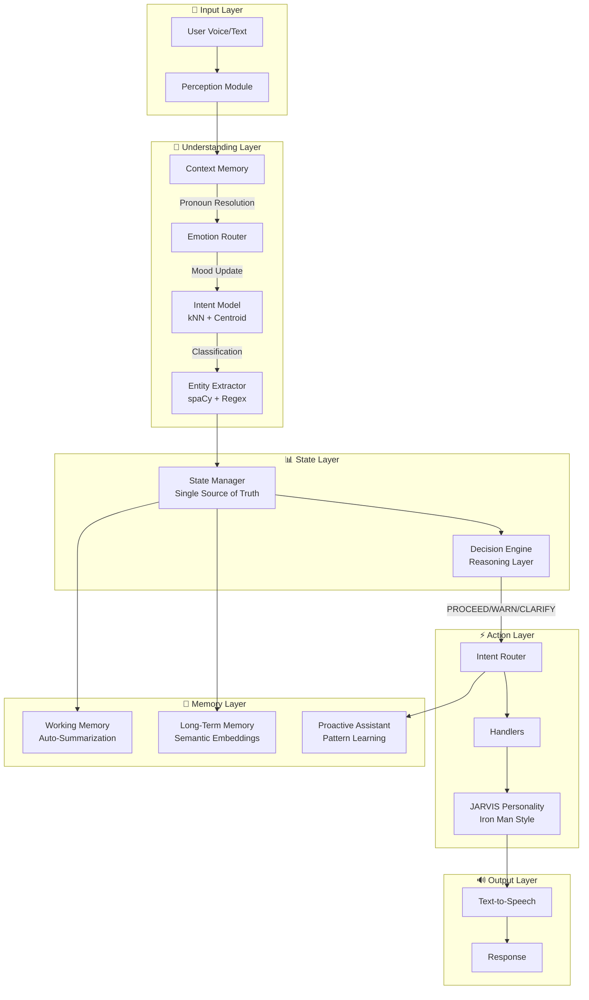
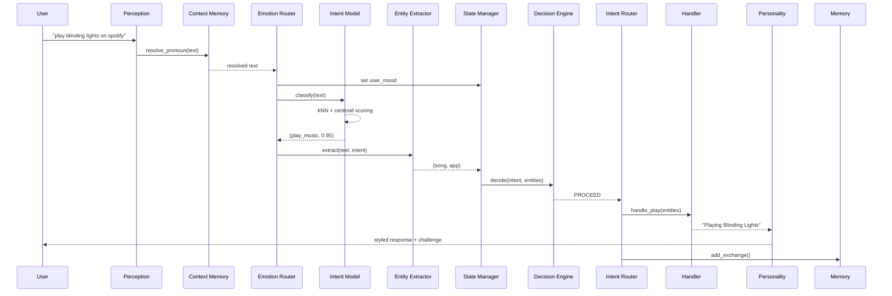
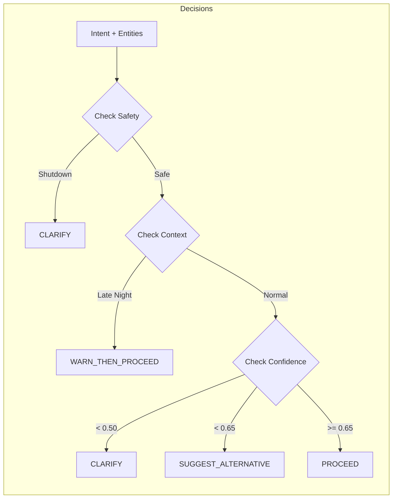

# JARVIS Architecture

## High-Level System Diagram



## Pipeline Flow



## Module Responsibilities

| Module | Responsibility |
|--------|----------------|
| **Perception** | Voice recognition, TTS output |
| **Context Memory** | Pronoun resolution, working memory, summarization |
| **Emotion Router** | Detect user mood, update state |
| **Intent Model** | Classify intent (kNN + centroid + rejection) |
| **Entity Extractor** | Extract entities (spaCy + regex hybrid) |
| **State Manager** | Single source of truth for all state |
| **Decision Engine** | Reason about HOW to handle (warn/clarify/refuse) |
| **Intent Router** | Dispatch to correct handler |
| **Personality** | Iron Man style, challenges, wit |
| **Handlers** | Music, Alarm, Apps, Search, etc. |
| **Proactive Assistant** | Pattern learning, suggestions |

## Decision Engine Flow



## File Structure

```
jarvis/
├── jarvis_ultimate.py       # Main brain
├── core/
│   ├── intent_model.py      # kNN + centroid classifier
│   ├── intent_definitions.py # Training examples
│   ├── entity_extractor.py  # spaCy + regex
│   ├── state_manager.py     # Single source of truth
│   ├── decision_engine.py   # Reasoning layer
│   ├── intent_router.py     # Dispatch logic
│   ├── personality.py       # Iron Man style
│   ├── context_memory.py    # Working + long-term
│   ├── emotion_router.py    # Mood detection
│   ├── proactive_assistant.py # Pattern learning
│   └── logger.py            # Structured logging
└── tests/
    ├── test_intent_model.py
    ├── test_intent_router.py
    └── test_entity_extractor.py
```
